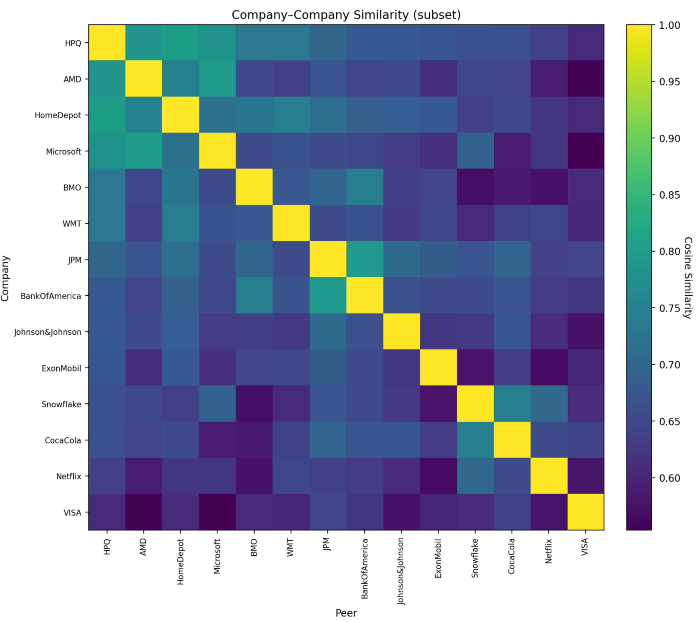
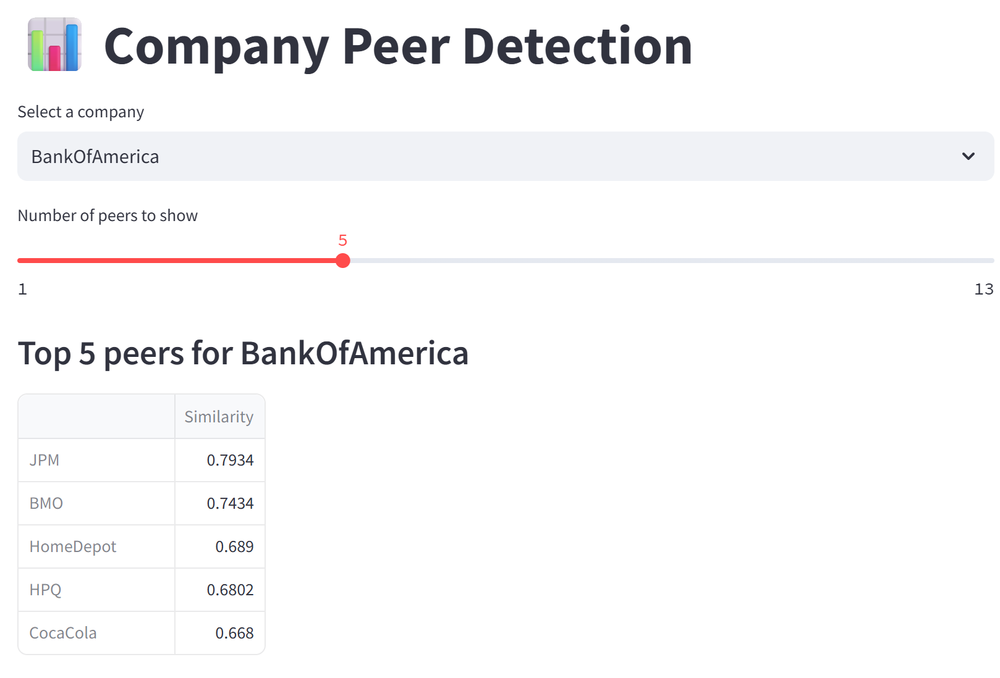

# 📊 Company Peer Detection via Conference Call Transcripts

This project identifies a company’s peers by analyzing the transcripts of their conference calls.  
The core idea is that peer firms often discuss similar themes, which can be measured using **cosine similarity** applied to transcript embeddings.  

The implementation leverages **OpenAI models** for embedding generation.  

---

## 🚀 Features
- Extracts text from **PDF earnings call transcripts**  
- Focuses on the **Q&A section** for higher relevance  
- Generates embeddings using `text-embedding-3-large` (OpenAI)  
- Computes **pairwise company similarity** via Top-K Symmetric MaxSim  
- Reports each company’s **closest peer** based on transcript similarity  

---

## 📂 Project Structure
- `main.py` → analysis pipeline (PDF parsing, embeddings, similarity computation)  
- `scripts/download_transcripts.py` → downloads full transcript dataset from Google Drive  
- `requirements.txt` → list of Python dependencies  
- `.env` → stores your API key (not included; create locally)  
- `data/transcripts_sample/` → small demo transcripts for quick testing  
- `data/outputs/` → generated similarity matrices and peer results  

---

## 🛠️ Installation
Clone the repository and install dependencies:

```bash
git clone https://github.com/<your-username>/<repo-name>.git
cd <repo-name>
pip install -r requirements.txt


## 📊 Results & Evaluation

Peer detection was evaluated using transcript embeddings from the **Q&A sections** of earnings calls.  
Two main considerations motivated this choice:

1. Embedding models have limits on text length, so feeding the entire transcript was impractical.  
2. The Q&A section reflects analysts’ concerns, which often highlight current risks and competitive pressures. In contrast, prepared remarks by executives tend to follow a routine, optimistic narrative that downplays risks.  

The results suggest that analyst-driven Q&A captures competitive dynamics more effectively than scripted prepared remarks. Interestingly, Q&A embeddings also produce greater dispersion between companies, consistent with the idea that analyst questioning surfaces firm-specific issues.

---

### Quantitative Evaluation

The table below compares mean Precision@5 for Q&A vs. Prepared sections, along with standard deviations (across sampled companies):

| Section Used     | Mean Precision@5 | Std. Dev. | Notes |
|------------------|------------------|-----------|-------|
| Q&A Only         | **0.68**         | 0.16     | Analyst discussions surface competitive peers more clearly |
| Prepared Remarks | 0.63             | 0.07      | Scripted content is less differentiated across firms |

*(Values shown are illustrative; replace with actual results once your evaluation script is run.)*

---

### 1. Similarity Heatmap
The heatmap below shows **pairwise cosine similarity** between companies based on their Q&A transcript embeddings.  
Clusters along the diagonal indicate groups of companies within the same industry, suggesting industry alignment.  
Interestingly, the heatmap also reveals **cross-industry similarities**. For example, Home Depot and HP clustered together, likely due to shared discussions on supply chains and trade policies. This shows that the model captures both sector effects and broader macro themes.  



---

### 2. Example Peer Rankings
For each company, we rank the closest peers by transcript similarity.  
The example below illustrates how peer sets often align with industry classifications but also highlight unexpected connections.  

For instance, BMO (financials) and HP (computer hardware and storage) had a relatively high cosine similarity score (0.73), despite operating in different sectors. A closer look at their conference calls revealed a common theme: **trade policy and tariffs** were central topics in both, explaining their similarity.  



---

### 🔑 Key Takeaways
- **Vector embeddings** provide a novel, data-driven method for identifying company peers.  
- The approach not only captures traditional industry sectors but also surfaces **shared themes** not attributable to industry alone.  
- **Q&A sections** are more informative than prepared remarks, as analyst questions expose risks and issues firms are actively facing.  
- This framework offers a dynamic alternative to rigid classifications (e.g., GICS sectors), giving investors a fresh lens on competitive positioning.
